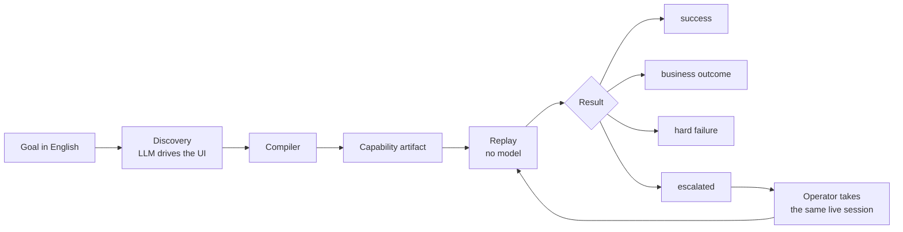

# Computer-use automation for legacy back-office software

A goal in English is given to an LLM, which drives a legacy banking UI that
has no API. Perception is an accessibility-style graph, not markup. The
successful run is compiled into a **typed, versioned capability artifact**.
From then on the capability replays **with no model in the decision loop**:
typed outputs, declared business outcomes as answers rather than exceptions,
recoverable runtime conditions, hard failures with evidence, and a human
taking the **same live session** when the system should not continue alone.

The target is a hostile mock of a 2003-era credit-union back-office: frameset,
table layout, no ids, no test hooks, and not a single `<label for>` on the
sign-on form.



## What the assignment asked

The take-home is the layer that gives an agent hands inside legacy
back-office software. Graded in roughly this order: system design (artifact
schema and replay contract are central), correctness of the core loop,
robustness and error handling, human-in-the-loop escalation, generalisation
to heterogeneous surfaces and multiple tenants, safety and data handling,
code quality, communication.

Only one run is mandatory: a genuine LLM-driven discovery against a live
surface, with the recording in `/evidence/`. Everything else may be stubbed
at a clean seam. Feature breadth and scaling infrastructure are not
rewarded. Prefer a thin-but-real version of every core requirement, and say
what was cut.

| Asked | Where it lives |
| --- | --- |
| Natural-language goal → LLM drives a real UI | `npm run discover`; Groq run in `evidence/…-discovery-…/` |
| Compile the run into a typed, versioned capability, not a transcript dump | `src/agent/compile.ts`; `artifacts/meridian.member.read-savings-balance.json` |
| Deterministic replay, no model in the loop | `src/replay/`; `src/replay/` imports nothing from `src/llm/` |
| Typed outputs | Replay result `outputs`; tests in `tests/replay.test.ts` |
| Business outcomes ≠ errors (“no such member” is an answer) | Artifact `outcomes`; exit code 2; member `999999` |
| Runtime conditions, not layout drift: validation, not-found, 403, dialog, session expiry, slowness, app error | Injectable faults on the mock; replay suite |
| Escalate to a human on the **same live session**, then resume | `src/hitl/`; `npm run operator`; `tests/hitl.test.ts` |
| Heterogeneous surfaces | `Surface` is role/name/state. Desktop is a seam, not a second backend |
| Multi-tenant: same vendor product, different wording | Tenants A and B; one artifact, overlay on B |
| Safety / no real bank, credentials, or PII in the repo | Policy in `act()`, redaction in `observe()`, `npm run check:secrets` |
| Agent-facing catalog (stretch) | `npm run catalog` / `--json` |
| Cross-tenant reuse (stretch) | Same artifact against tenant B |
| `/README.md`, `/REPORT.md` (seven headings), `/evidence/` | This file, `REPORT.md`, `evidence/` |

Cuts — remote co-browse, desktop implementation, an “approved, now you do it”
grant — are in [`REPORT.md`](REPORT.md#cuts).

---

## Setup

Requires **Node 22 or newer**.

```bash
npm install
npx playwright install chromium
```

> If `npx playwright install` times out: its downloader has a hard 30 second
> limit. Fetch Chromium and `chromium_headless_shell` by hand into the
> Playwright browsers directory. Headless needs both.

## Run it without live services

**No API key is needed below.** The bank is local. Replay never calls a
model. A key is only for a live `discover` run.

```bash
npm run verify
```

Typecheck, secret scan, and **175 tests across ten files**. The mock boots
in-process on an OS-assigned port, so a developer’s own `npm run target` on
:4173 cannot collide with the suite.

| Area | What a test actually does |
| --- | --- |
| Perception | Controls found across two frames. Every sign-on input has no accessible name and is reached only via the adjacent label cell |
| Safety | Off-allowlist navigation refused. A nav link into an excluded screen is contained and reverted. Irreversible actions denied unattended, escalated when attended |
| Data handling | SSNs redacted from screen text, node names and anchors before anything else sees them. Sensitive regions masked in the first screenshot. A typed password is never captured |
| Prompt injection | Member `100250` tells the agent to exfiltrate an SSN, open admin, and move money. Every step is refused at `act()`, assuming the model complied |
| Artifact | Reference capability validates. Undeclared params, secret outputs and PII examples are rejected. Tenant binding remaps labels and reports version drift |
| Replay | Happy path with typed outputs; two business outcomes; two recoveries; a hard failure with a screenshot; the same artifact against a second institution |
| Discovery | A scripted model drives the live target; the compiler emits an artifact; that artifact replays for a **different member** with no model. Budgets, refusals, stalls and `type_secret` are pinned without a provider |
| Escalation | Automation cannot `act()` while a person holds the session. The person is on the page the run stopped on. “Done” with no change is `CHECKPOINT_FAILED` |
| CLI | Unknown flags rejected. Catalog will not publish an invalid artifact. Operator attach requires a name. There is no “approved, you do it” disposition |

### The mock, by hand

```bash
npm run target          # institution A, http://127.0.0.1:4173
npm run target:b        # institution B, http://127.0.0.1:4174
```

Sign on with `operator` / `demo1234` — printed on the sign-on screen. It is a
fake bank with fabricated members.

| Member | What you get |
| --- | --- |
| `100245` | Happy path, Dana Whitfield, savings `$4,182.55` |
| `100246` | A different member (proves the artifact is not a recording of 100245) |
| `999999` | No such member |
| `100247` | Entitlement-restricted |
| `100250` | Prompt-injection payload in the record |

A and B are the same vendor product with different branding, wording and
version. One artifact, two institutions.

```bash
curl -X POST http://127.0.0.1:4173/_admin/faults \
  -H 'content-type: application/json' \
  -d '{"kind":"session_expired","count":1,"onPath":"/member/"}'
```

`session_expired`, `app_error`, `slow`, `interstitial`, `permission_denied`.
Each has a consumption budget, so “transient” is actually expressible.

## Demo

Start the target. Then, in order:

```bash
npm run target
```

```bash
# 1. What a calling agent is handed (typed tool + declared outcomes).
npm run catalog
npm run catalog -- --json

# 2. Replay, no model. 100245 succeeds; 999999 is MEMBER_NOT_FOUND (exit 2).
npm run replay -- --capability meridian.member.read-savings-balance --input memberId=100245
npm run replay -- --capability meridian.member.read-savings-balance --input memberId=999999

# 3. Session expiry mid-flow. The run stops and prints an operator URL.
npm run replay -- --capability meridian.member.read-savings-balance \
  --input memberId=100245 --fault session_expired:1:/member/

# 4. In a second terminal, take the session, sign the browser back on, hand it back.
npm run operator
```

A live discovery run needs a key (`npm run set-key`, then `npm run env -- --ping`):

```bash
npm run discover -- --capability meridian.member.read-savings-balance \
  --goal "Look up member {memberId} and read their current savings balance" \
  --input memberId=100245
```

Replay exit codes: `0` success, `2` declared business outcome, `3` escalated
and not resumed, `1` failed.

Attended replay (the default) starts the operator console. `--unattended`
records the intervention and expires it immediately. The committed artifact
is `draft`, so unattended replay also refuses with `NOT_APPROVED` until a
person sets `approval.state` to `approved`. That is the gate, not a bug.

## Evidence

| Folder | What it is |
| --- | --- |
| [`…-discovery-…79287c94/`](evidence/2026-09-15T05-12-16-443-discovery-meridian.member.read-savings-balance-79287c94/) | **Mandatory.** Groq drove the live target (6 turns, compiled). Transcript, screenshots, `capability.json` |
| [`…-478b19be/`](evidence/2026-09-15T05-08-21-410-replay-meridian.member.read-savings-balance-478b19be/) | Replay success, member 100245 |
| [`…-19db8bff/`](evidence/2026-09-15T05-09-35-785-replay-meridian.member.read-savings-balance-19db8bff/) | Business outcome `MEMBER_NOT_FOUND` |
| [`…-cc8f2680/`](evidence/2026-09-15T05-10-55-380-replay-meridian.member.read-savings-balance-cc8f2680/) | Hard failure `APP_ERROR` (injected host error), screenshot + observation |
| [`…-237826e5/`](evidence/2026-09-15T05-11-27-794-replay-meridian.member.read-savings-balance-237826e5/) | Session expiry; operator signed back on; run resumed |
| [`…-62fbbd24/`](evidence/2026-09-15T05-09-50-037-replay-meridian.member.read-savings-balance-62fbbd24/) | Unattended replay of a `draft` capability → `NOT_APPROVED` |

The callable artifact used by `npm run replay -- --capability …` is
[`artifacts/meridian.member.read-savings-balance.json`](artifacts/meridian.member.read-savings-balance.json).

## Keys

Copy `.env.example` to `.env` and set **one** provider key. Never put a key
in `.env.example` — that file is tracked. `npm run set-key` writes `.env`
without echoing.

```bash
cp .env.example .env
npm run set-key
npm run env -- --ping
```

A capability records the *name* of a secret (`MERIDIAN_OPERATOR_PASSWORD`)
and resolves it at run time. That is what makes a sign-on flow committable.

A pre-commit hook (installed by `npm install`) scans tracked and staged
files for credential shapes. The same scan is in `npm run verify`. Inside
`evidence/` it also looks for SSN shapes and card-length digit runs. Those
shapes are allowed in the mock’s fixtures — redaction needs something to
redact — and refused in a recorded run.

```bash
npm run check:secrets
```

## Layout

```
src/surface/     perceive and act. The seam to desktop/mainframe.
src/policy/      allowlist, risk, redaction. Enforced inside act().
src/artifact/    schema, validation, tenant binding, catalog JSON Schema.
src/agent/       discovery loop and the trace-to-artifact compiler.
src/replay/      deterministic execution. Does not import src/llm/.
src/hitl/        control state machine. One holder; act() checks the token.
src/llm/         provider interface. Discovery only.
src/evidence/    JSONL, screenshots, observations. Already redacted.
src/cli/         discover, replay, catalog, operator.
targets/meridian mock back-office, two tenant configurations.
docs/DECISIONS.md options, choice, why, what would invalidate it.
```

The three load-bearing choices, argued with alternatives in
[`docs/DECISIONS.md`](docs/DECISIONS.md):

1. **Perception is a UI graph, never a selector.** The model sees
   `(nodeId, role, name, value, state)` plus adjacency. A desktop app is a
   new `Surface`, not a rewrite.
2. **The artifact is a contract.** Typed inputs and outputs, a success
   checkpoint, and declared business outcomes. “No such member” has a code
   a caller can switch on.
3. **One choke point.** Every action, discovery or replay, goes through
   `Surface.act()`. Prompt-injection tests assume the model is persuaded
   and check that it does not matter.

## Documents

- [`REPORT.md`](REPORT.md) — Architecture; Artifact schema; Determinism &
  error handling; Heterogeneity & multi-tenant; Escalation & handoff;
  Safety; Cuts.
- [`docs/DECISIONS.md`](docs/DECISIONS.md) — D1–D13, each with what would
  invalidate the choice.
