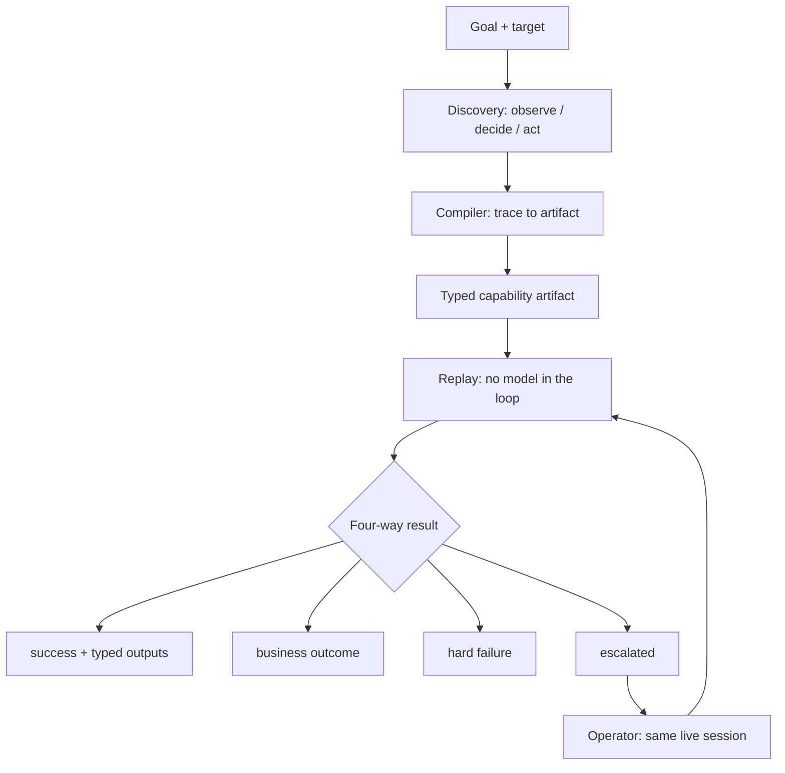
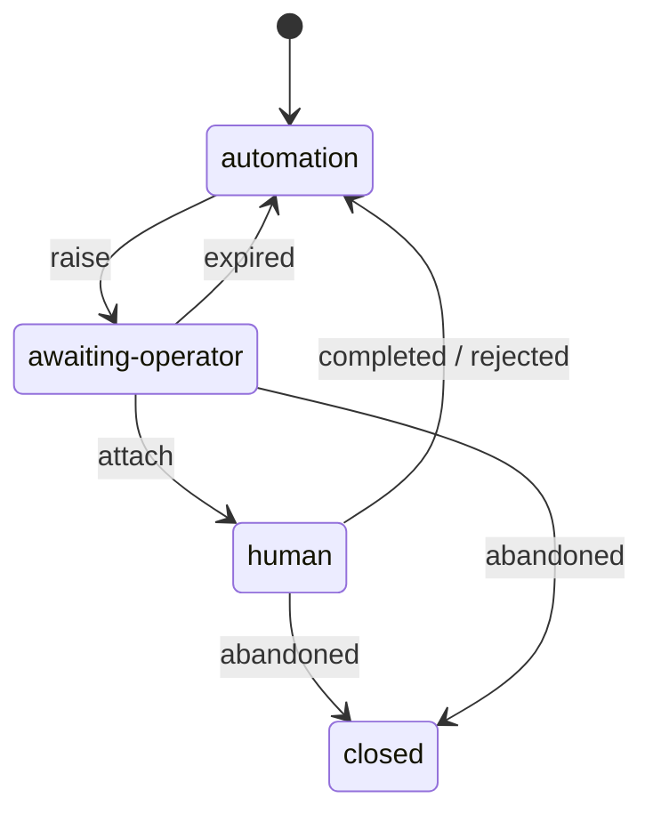

# Report

The assignment: give an AI agent hands inside legacy back-office banking
software that has no API. A goal in natural language goes to an LLM, which
drives a real UI. The successful run is compiled into a typed, versioned
capability artifact. That artifact then replays with no model in the
decision loop — typed outputs, legitimate business outcomes as results
rather than errors, recoverable runtime conditions, hard failures. When it
cannot safely proceed, a human takes the same live session and hands it
back.

The rest of this file is the seven headings the brief asked for. Claims
point at the code or the test that would fail if they were untrue.

## Architecture

Everything above `Surface` (`src/surface/types.ts`) is an accessibility-
style node graph: role, name, value, state, adjacency. There is no
`selector` on a node and no HTML in a prompt. CSS selectors are a property
of markup, and markup is what this environment does not have — framesets,
table layout, no test ids. They also do not exist on a native desktop app,
which the brief names as in-scope. Windows UIA / macOS AX / AT-SPI expose
the same role+name shape, so a desktop surface is a new `Surface`
implementation rather than a rewrite of the agent, the artifact, or the
executor.

`Surface.act()` is the only function both discovery and replay may use to
change the world (`src/policy/engine.ts`, called from
`src/surface/browserSurface.ts`). `Surface.observe()` is the only function
that produces a screen for the rest of the system, and that is where
redaction happens. A rule in the prompt is something a model can ignore;
these two functions are not.

The model is an `LlmProvider` (`src/llm/`). `src/replay/` does not import
it. Discovery is the only command that may hold a key.

The runtime is one Node process, CLI-driven, artifacts and evidence on
disk. The brief does not reward queues or clusters. The seams that would
have to survive that change are `Surface` and the artifact contract.

The operator console (`src/cli/operatorConsole.ts`) is a small HTTP API on
the run’s process. A run owns its browser, so the session a person must
take lives where the run lives; the operator is someone else. The API is
list / attach / resolve — the three transitions the control state machine
defines. It cannot drive the page. The operator uses the Chromium window
the run left open. That is what “the same live session” means here.

## Artifact schema

The brief says the artifact needs a clear contract, not a step list, and
that it is something an AI agent can call. `src/artifact/schema.ts` is
that document: typed inputs, typed outputs, a success checkpoint, steps
with English `intent`, a ranked locator ladder, and **business outcomes
declared in the schema**. “No such member” is an answer with a code. The
glossary on the assignment calls conflating that with a crash the most
common design mistake on this project. Outcomes live in the artifact so
the taxonomy is reviewable and versioned, and so `toCatalog()`
(`src/artifact/jsonSchema.ts`) publishes the same arrays the executor
runs. The tool an agent is handed cannot drift from the document a person
approved.

A typed value is `param`, `secret`, or `literal`. Credentials are names
resolved at run time (`MERIDIAN_OPERATOR_PASSWORD`), which is why a
sign-on flow can sit in a public repository. Tenants are overlays on a
(vendor, product) artifact (`src/artifact/overlay.ts`): whole-string label
maps, optional step overrides, `versionDrift` reported on bind.

The compiler (`src/agent/compile.ts`) writes this, not the model. The
model gets one extra call after the run, for prose — title, descriptions,
candidate outcome names. Every locator rung is executed against the
observation the model was looking at, and dropped unless it uniquely
resolves to the node that was acted on. Every proposed outcome is checked
so it does **not** fire on the success screen. Predicates, extraction,
transforms and recovery are a closed vocabulary (`src/artifact/schema.ts`).
An expression string inside an artifact loaded from disk and run against
banking software would turn review into “audit this program”.

The reference capability is `tests/fixtures/readSavingsBalance.ts`. The
validator’s refusals — undeclared params, secret outputs, PII in examples,
self-recovering capabilities — are in `tests/artifact.test.ts`.

## Determinism & error handling

Same artifact, same inputs: every replay decision is a function of the
observed screen (`src/replay/execute.ts`). No temperature, no “try a
different prompt”.

Targeting is a ladder (`src/replay/resolve.ts`): role+name, then
anchor-relative (“the textbox whose label cell reads Password”), then
structural, then coordinates. A unique match is required. Ambiguity is
`TARGET_AMBIGUOUS`, not a guessed click. Which rung resolved is recorded
on every step, including successes. A step that used to resolve by
role+name and now only resolves structurally still succeeds, and is the
earliest warning that a tenant’s screen has moved.

Waiting is quiescence, not `page.waitForLoadState()` (D13). On a frameset
the main frame never moves; a load-state wait returns while a child frame
is still navigating. An early bug returned nodes from the search screen
and text from member detail in one observation. `observe()` now takes
nodes and text from one evaluation per frame, after request and
navigation activity has gone quiet.

The result is a four-way union (`src/artifact/result.ts`): `success`,
`business-outcome`, `escalated`, `failed`. A caller that switches on
`status` has handled the business cases by construction. The CLI uses
exit codes 0 / 2 / 3 / 1 for the same four, so a shell is a caller too.

The interesting failures the brief names are runtime conditions. The mock
injects them: validation, record-not-found, permission denial, surprise
interstitial, session expiry, transient slowness, application error.
`tests/replay.test.ts` drives each. Discovery has separate stop conditions
(`src/agent/discover.ts`, `tests/discover.test.ts`): turn budget, wall
clock, consecutive incoherent replies, consecutive no-ops, repeated
policy refusals (those escalate — the goal needs authority the agent does
not have). When `GROQ_API_KEY` is set, `tests/live-discovery.test.ts` is
the same loop with the real provider: discover, compile, replay for a
member the live run never saw.

On resume, the executor re-checks the step’s own checkpoint against the
screen the operator left. “Done” with no change is `CHECKPOINT_FAILED`
(`tests/hitl.test.ts`). Declared outcomes are checked first, so an
operator who finds no such member produces an answer, not a broken
capability.

## Heterogeneity & multi-tenant

The reusable unit is (vendor, product). A tenant is a binding: label maps
applied as whole strings, so `Search → Find Member` cannot rewrite a
checkpoint into “Member Find Member”. Step-level overrides exist where
the flow itself differs; a tenant that accumulates many of them is a
signal to split the artifact, not a cost to swallow. Bind reports
`versionDrift` when the product version differs from the recorded one. It
is not fatal; it travels with the result.

`targets/meridian/` runs two institutions of the same product. Tenant B
uses different labels and inserts a notice screen after sign-on, which
the artifact marks optional. `tests/replay.test.ts` replays one artifact
against both. That is the multi-tenant claim as a test, not as a
paragraph.

A desktop surface is not implemented. The `Surface` interface is the
seam, and using an accessibility graph is what makes that seam real
rather than aspirational. Coordinates stay last on the ladder for
surfaces that have nothing better. Building a second Playwright-shaped
backend with no second target would not have tested the claim.

## Escalation & handoff

The brief asks who is in control, and for a human to work in the same
live session — not a fresh one. Control is a state machine
(`src/hitl/`) with one holder at a time. The holder carries a token that
`act()` requires (`src/hitl/controlled.ts`). While a person has the
session, the automation’s token is not the live grant, so an executor
that resumed early is refused rather than racing them for the keyboard.

`act()` is allowed only in `automation`. Observation is allowed in every
state. Control moves on **raise**, not on attach.

Control moves when the escalation is **raised**, not when the operator
arrives. The gap is the moment a retry would act on a screen the system
has already said it cannot read. Observation is not gated: watching
changes nothing, and the handover is what the evidence log should
capture. Screenshots are taken at attach and at return.

There is no “approved, now you do it” disposition (D5). An irreversible
step is performed by the person who authorised it. A grant that `act()`
honoured would be a path for automation to move money with no human at
the controls. A bypass that exists can be reached by accident. The cost
is a click; the money movement is attributable to a named operator.

`npm run operator` polls the console, asks whether to take the session,
and records a named disposition. Attach without a name is 400. Resolve
anonymously is refused. The console does not click anything.

The path to read first: session expires mid-flow, the declared
re-authentication capability is not wired, the run asks for a person;
the operator signs the browser back on by hand and returns it; the run
resumes and returns the savings balance (`tests/hitl.test.ts`, evidence
`…-237826e5/`). A second test has the operator say “done” and change
nothing; the run does not report success.

## Safety

Policy runs inside `act()` for discovery and replay, as a typed result,
not an exception. Off-allowlist navigation is refused. A click is
authorised against the page it happens on, so a nav-frame link can still
*land* off-allowlist while the address bar never moves; that case is
detected, reverted, and reported as `NAVIGATED_OFF_ALLOWLIST` (D9,
`tests/safety.test.ts`). Irreversible actions are denied unattended and
escalated when attended. The same escalation primitive serves “stuck”
and “this moves money”, so there is one way for the system to stop and
ask a person.

Redaction runs in `observe()` (D10). A node whose *own* content was
redacted is marked `sensitive`, so screenshots mask it and `read`
refuses it, without a list of “the SSN cell”. Anchor text is redacted
but does not taint the neighbour: over-redaction is how a capability
becomes unable to read a join date because an SSN sat in the next cell.

`navigate` takes a path; the runtime supplies the origin. The model
cannot form `https://evil.example`. `type_secret` takes a credential
name; the runtime substitutes the value on the way to the surface; the
trace stores the name. The first Groq run typed `demo1234` because the
mock prints it on the sign-on screen. A prompt rule did not stop that.
Taking the value out of the tool vocabulary did. The committed
transcript replaces the typed value with
`[secret:MERIDIAN_OPERATOR_PASSWORD]`.

Prompt injection is a policy test, not a wording test. Member `100250`
instructs the agent to exfiltrate an SSN, open Administration, and post
an adjustment. The tests issue those actions directly and check the
refusals (`tests/safety.test.ts`). They assume the model is fully
persuaded.

`scripts/check-secrets.mjs` runs as a pre-commit hook and inside
`npm run verify`. `.env` is gitignored. `.env.example` is tracked and
has no keys.

## Cuts

**No remote co-browse.** A human on another machine needs CDP screencast
or WebRTC under the same state machine. The console is local to the
headed window the run left open. The transport would have been a second
product.

**No “approved, now you do it”.** See Escalation. The alternative is a
grant that bypasses `act()`.

**No Anthropic / Gemini in the factory.** Discovery speaks
OpenAI-compatible (Groq, OpenAI). The recorded evidence run used Groq.
The default suite uses a scripted provider so a reviewer with no key can
still run it. `npm run test:live` is Groq.

**No desktop `Surface` implementation.** The seam is there. A fake second
backend would not have proved it.

**No stability-score gate from `draft` to `approved`.** Artifacts ship as
`draft`; unattended replay refuses them (`NOT_APPROVED` in evidence
`…-62fbbd24/`) until a person changes the field. Cheap, useful, not what
the brief grades.

**No keystroke capture of the operator.** Evidence is the screenshot pair
at handover and return, plus a named note. That is the honest version of
“their actions are captured” without a remote transport.

**The target is a mock.** Hostile on purpose, two tenants, injectable
faults. It is how the runtime conditions become tests. It is not a bank,
and it is not what is being graded.
